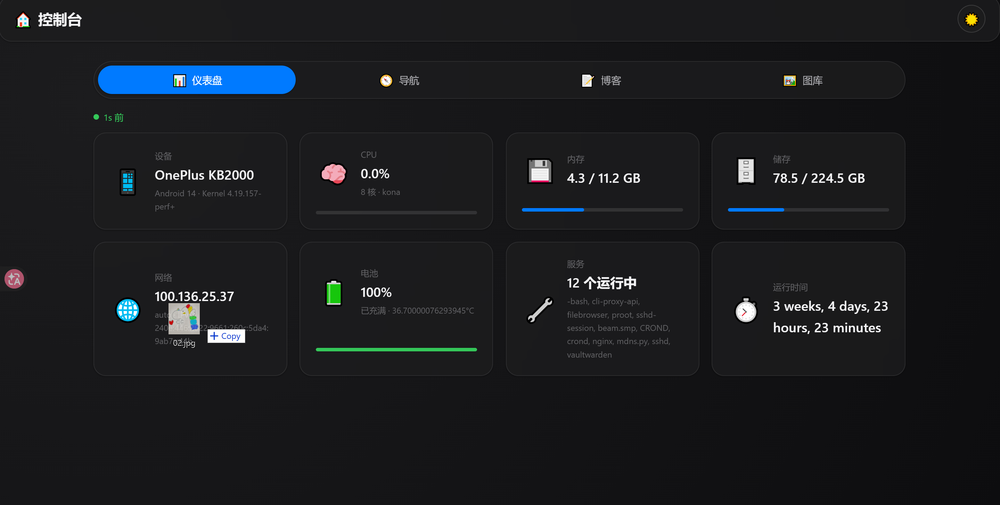
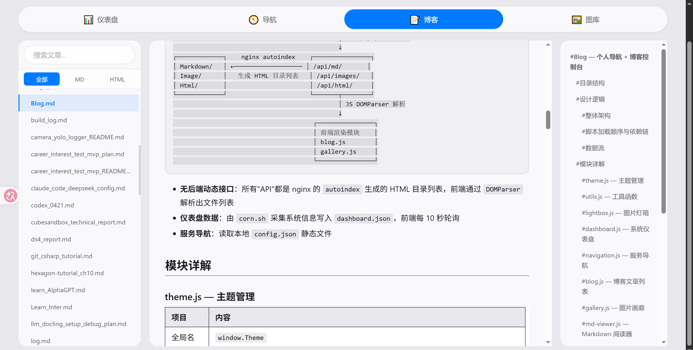
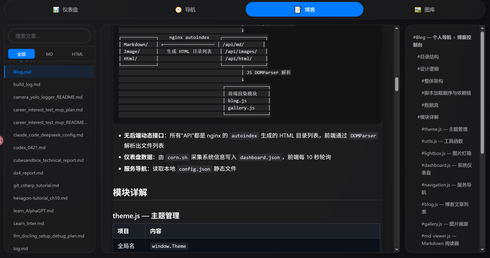

# Blog-termux — Personal Dashboard + Blog Console
[简体中文](README.md) | [English](README_EN.md)  

A pure static single-page application powered by Nginx. No PHP, Node.js, Python, or any backend runtime required. Integrates **system dashboard**, **service navigation**, **Markdown blog reader**, and **image gallery** into one page, with responsive layout for PC, tablet, and mobile.





> Share my way about make your phone as a little Homelab[termux的使用总结](Markdown/termux使用总结.md)  
> Originally forked from [bastienwirtz/homer](https://github.com/bastienwirtz/homer.git), extensively rewritten over time into its current form.

---

## Table of Contents

- [Quick Start](#quick-start)
- [Directory Structure](#directory-structure)
- [Architecture](#architecture)
- [Module Reference](#module-reference)
- [Deployment Guide](#deployment-guide)
  - [1. Requirements](#1-requirements)
  - [2. Download Dependencies](#2-download-dependencies)
  - [3. Configure Nginx](#3-configure-nginx)
  - [4. Configure Service Navigation](#4-configure-service-navigation)
  - [5. Setup Dashboard Cron](#5-setup-dashboard-cron)
  - [6. Add Content](#6-add-content)
  - [7. Launch](#7-launch)
- [Usage](#usage)
- [FAQ](#faq)

---

## Quick Start

```bash
# 1. Clone to your server
git clone https://github.com/lost-clouds/Blog-termux.git ~/Blog-termux

# 2. Download frontend dependencies (one-time)
cd ~/Blog-termux/lib
curl -sSLO https://cdn.jsdelivr.net/npm/marked/marked.min.js
curl -sSLO https://cdn.jsdelivr.net/npm/katex/dist/katex.min.js
curl -sSLO https://cdn.jsdelivr.net/npm/katex/dist/katex.min.css
curl -sSLO https://cdn.jsdelivr.net/npm/katex/dist/contrib/auto-render.min.js
curl -sSLO https://cdn.jsdelivr.net/npm/github-markdown-css/github-markdown.min.css

# 3. Copy nginx config, update paths
cp example/Blog.conf $PREFIX/etc/nginx/conf.d/Blog.conf
# Edit: replace /path/to/Blog-termux with your actual absolute path

# 4. Setup dashboard cron (every 30s)
# corn.sh takes output path as first argument (default: /path/to/Blog-termux/dashboard.json)
# Add crontab:
#   crontab -e
#   * * * * * ~/Blog-termux/corn.sh ~/Blog-termux/dashboard.json
#   * * * * * sleep 30; ~/Blog-termux/corn.sh ~/Blog-termux/dashboard.json

# 5. (Optional) Generate static index for faster article/image loading
bash ~/Blog-termux/gen_index.sh ~/Blog-termux
# Add to cron for periodic updates: */5 * * * * bash ~/Blog-termux/gen_index.sh ~/Blog-termux

# 6. Reload nginx and open
nginx -s reload
# Visit https://127.0.0.1:7443 in browser
```

---

## Directory Structure

```
Blog-termux/
├── index.html                       # Single entry point — tabbed SPA
├── config.json                      # Service navigation config
├── corn.sh                          # System metrics collector (no root)
├── gen_index.sh                     # Static index generator (index.json)
├── sw.js                            # Service Worker (offline cache + SWR)
├── .gitignore
├── LICENSE                          # MIT
├── favicon.ico
│
├── css/
│   ├── style.css                    # Built output — merged full stylesheet
│   ├── build.sh                     # CSS build script (cat merge)
│   ├── split.sh                     # CSS split script
│   └── src/                         # CSS source (modular split)
│       ├── _header.css
│       ├── variables.css            #   CSS custom properties
│       ├── base.css                 #   Reset + typography
│       ├── layout.css               #   Page layout
│       ├── responsive.css           #   Responsive breakpoints
│       ├── components/              #   Component styles
│       └── themes/
│           └── dark.css             #   Dark mode overrides
│
├── js/                              # ES Modules
│   ├── main.js                      #   Module entry — imports all in order
│   ├── theme.js                     #   Theme manager
│   ├── utils.js                     #   Utilities
│   ├── lightbox.js                  #   Image lightbox
│   ├── dashboard.js                 #   System dashboard
│   ├── navigation.js                #   Service navigation
│   ├── blog.js                      #   Article list + reader
│   ├── gallery.js                   #   Image gallery
│   ├── md-viewer.js                 #   Markdown reader (overlay)
│   └── app.js                       #   Main controller
│
├── lib/                             # Third-party libraries (all local, zero CDN)
│   ├── marked.min.js                #   Markdown parser
│   ├── katex.min.js                 #   LaTeX math rendering
│   ├── katex.min.css                #   KaTeX styles
│   ├── auto-render.min.js           #   KaTeX auto-render
│   └── github-markdown.min.css      #   GitHub-flavored Markdown styles
│
├── Markdown/                        # .md articles
├── Html/                            # .html articles
├── Image/                           # Images (scanned by gen_index.sh → shown in gallery)
│   ├── posts/                       #   Article images → ✅ shown in gallery
│   ├── gallery/                     #   Standalone images → ✅ shown in gallery
│   ├── thumbnails/                  #   Thumbnail cache → ❌ skipped (gen_index.sh excludes)
│   └── archive/unused/              #   Orphan images → ❌ skipped (gen_index.sh excludes)
│
└── example/
    ├── Blog.conf                    # Nginx config template
    ├── example.png                  # Screenshot (dashboard + nav)
    ├── example0.png                 # Screenshot (blog layout - light)
    └── example1.png                 # Screenshot (blog layout - dark)
```

---

## Architecture

### Overall Layout

```
index.html (SPA)
  │
  ├─ header ─── brand title + theme toggle (☀️/🌙)
  │
  ├─ tab-bar ── [📊Dashboard] [🧭Nav] [📝Blog] [🖼️Gallery]
  │              PC/tablet top | mobile bottom-fixed
  │
  ├─ content area (4 sections, 1 visible at a time)
  │   ├── #sec-dashboard    8 cards: device/CPU/memory/storage/network/battery/services/uptime
  │   ├── #sec-nav          service group cards, search filter, click to open
  │   ├── #sec-blog         three-column: sidebar(article list) | content | ToC, search/filter/inline render
  │   └── #sec-gallery      image grid, search, click lightbox
  │
  ├─ md-overlay (fullscreen) ── Markdown reader
  │   ├── TOC sidebar (slide-in from left)
  │   ├── reading progress bar
  │   ├── content area (marked + KaTeX)
  │   └── image lightbox
  │
  └─ lightbox (fullscreen) ──── image lightbox
```

### Script Load Order

```
 main.js           → ES Module entry, loaded via <script type="module">
   ├── theme.js         → no deps
   ├── utils.js         → no deps
   ├── lightbox.js      → no deps
   ├── dashboard.js     → no deps
   ├── navigation.js    → depends on utils.js
   ├── blog.js          → depends on utils.js, references MdViewer at runtime
   ├── gallery.js       → depends on utils.js + lightbox.js
   ├── md-viewer.js     → depends on marked (global) + utils.js + lightbox.js
   └── app.js           → depends on all, loads last, boot entry
```

All business JS uses **ES Modules** (`export`/`import`), loaded via `main.js` as a single `<script type="module">` entry point. Modules also attach to `window.*` for cross-module compatibility. The only regular `<script>` tag is `lib/marked.min.js` (provides the global `marked` parser). Module scripts auto-defer until DOM is ready.

### Data Flow

```
System metrics      corn.sh (cron every 30s)     dashboard.json
(top/free/df        ──────────────────────────→   JSON file on disk
 ifconfig/ps)                                            │
                                                         │ GET /api/dashboard (nginx alias)
                                                         ↓
                                                   dashboard.js (poll every 10s)
                                                   → updates 8 dashboard cards
                                                   → auto-detects running services

Markdown/           nginx autoindex             /api/md/ (HTML directory listing)
Image/              ───────────────────→        /api/images/
Html/                                           /api/html/
                                                         │
                                                         │ JS DOMParser parses HTML
                                                         ↓
                                                   blog.js / gallery.js
                                                   → renders article list / image grid
```

Core idea: **gen_index.sh generates index.json as primary data source, with nginx autoindex fallback**. The frontend first fetches `Markdown/index.json` / `Image/index.json` (fast, structured), falling back to DOMParser-based autoindex parsing if the index is missing (404). `gen_index.sh` can be run manually or added to cron for periodic updates.

---

## Module Reference

### theme.js — Theme Manager

| | |
|---|---|
| Global | `window.Theme` |
| Storage | `localStorage["app-theme"]` |
| API | `initTheme()` `toggleTheme()` `applyTheme(theme)` `getStoredTheme()` |

Toggles `body.dark` class to globally switch CSS variables, updates `<meta name="theme-color">` for browser chrome, and toggles button icon (☀️/🌙).

---

### utils.js — Utilities

| | |
|---|---|
| Global | `window.Utils` / `window.downloadFile` |
| API | `escapeHtml(str)` `formatSize(bytes)` `downloadFile(url, name)` |

`escapeHtml` escapes `& < > "` on all user-controlled filenames before DOM insertion (XSS prevention).
`downloadFile` uses `fetch → Blob → ObjectURL` to work around cross-origin `<a download>` limitations.

---

### lightbox.js — Image Lightbox

| | |
|---|---|
| Global | `window.Lightbox` |
| API | `init()` `open(src, name)` `close()` |

Close via background click / close button / ESC. Gallery and Markdown images share the same lightbox instance.

---

### dashboard.js — System Dashboard

| | |
|---|---|
| Global | `window.Dashboard` |
| Source | `GET /api/dashboard` (every 10s) |
| API | `init()` `update(data)` `fetchData()` |

Renders 8 cards:

| Card | Content | Bar |
|------|---------|-----|
| 📱 Device | brand+model · Android · kernel | — |
| 🧠 CPU | usage% · cores · processor model | blue |
| 💾 Memory | used / total (GB/MB) | blue |
| 🗄️ Storage | used / total (GB) | blue |
| 🌐 Network | local IP · interface · IPv6 | — |
| 🔋 Battery | level% · charging status · temp | green |
| 🔧 Services | N running · process name list | — |
| ⏱️ Uptime | e.g. "3d 12h 30m" | — |

> Services card uses `ps -e` to auto-scan all processes with noise filtering. New services are detected without script changes.

`dashboard.json` format (generated by corn.sh):
```json
{
  "device": {"model": "OnePlus KB2000", "android": "14", "kernel": "4.19"},
  "cpu": {"usage": 12.3, "cores": 8, "model": "kona"},
  "memory": {"used": 4.3, "total": 11.2, "unit": "GB"},
  "disk": {"used": 64.8, "total": 224.5, "unit": "GB"},
  "network": {"ip": "192.168.1.5", "ipv6": "240e:...", "iface": "wlan0"},
  "battery": {"level": 85, "status": "FULL", "temp": 40.0},
  "services": {"running": ["nginx","crond","sshd","couchdb","vaultwarden"], "count": 5},
  "uptime": "2 weeks, 1 day, 4h"
}
```

---

### navigation.js — Service Navigation

| | |
|---|---|
| Global | `window.Navigation` |
| Source | `GET /config.json` |
| API | `init()` `render()` `search()` |

Reads `config.json`, renders service cards grouped by category. Search filters by name, subtitle, and tag. Cards open URLs with `target="_blank"`.

---

### blog.js — Blog (Hugo Book-style three-column layout)

| | |
|---|---|
| Global | `window.Blog` |
| Source | `GET /api/md/` + `GET /api/html/` |
| API | `init()` `fetchArticles()` `selectArticle(filename, type)` |

Desktop: scrollable sidebar (article list + search/filter) | inline rendered content | auto-generated ToC.
Mobile: sidebar slides in via CSS checkbox, ToC drops down from header.
Rendering reuses `MdViewer.render()` and `MdViewer.buildToc()`, sharing the engine with the fullscreen overlay. HTML articles still open in new tab.

---

### gallery.js — Image Gallery

| | |
|---|---|
| Global | `window.Gallery` |
| Source | `GET /api/images/` |
| API | `init()` `render()` `fetchImages()` |

Thumbnail grid with search. Click → `Lightbox.open(src, name)`. Failed images auto-hide with no broken icon.

---

### md-viewer.js — Markdown Reader

| | |
|---|---|
| Global | `window.MdViewer` |
| Source | `GET /Markdown/<filename>` |
| API | `init()` `open(filename)` `close()` |

Fullscreen overlay with:

| Feature | Implementation |
|---------|---------------|
| Markdown parsing | marked engine |
| Math formulas | KaTeX, lazy-loaded (only when `$$`/`$`/`\[` detected) |
| TOC | Parses h1–h6, indented, slide-in sidebar |
| Reading progress | 3px blue progress bar at top |
| Heading anchors | Injects `#` permalink on each heading |
| Image handling | Relative paths → `/api/images/<name>`, click for lightbox |
| Shortcuts | ESC closes lightbox first, then reader |

---

### app.js — Main Controller

| | |
|---|---|
| Global | none (ES module entry, not exported) |
| Role | Boot initialization, tab routing, responsive adaptation |

Boot sequence:
```
1.  Theme.initTheme()        → apply stored theme
2.  Lightbox.init()          → bind lightbox events
3.  MdViewer.init()          → pre-bind reader events
4.  Dashboard.init()         → start dashboard polling
5.  Navigation.init()        → load nav config + render
6.  Blog.init()              → cache DOM + fetch articles
7.  Gallery.init()           → cache DOM + fetch images
8.  Bind tab bar + theme button events
9.  Restore last tab from URL hash
10. Mobile responsive adaptation
```

---

## Deployment Guide

### 1. Requirements

| Component | Purpose | Notes |
|-----------|---------|-------|
| Nginx | Web server | Termux: `pkg install nginx` |
| cron / crond | Run corn.sh on schedule | Termux: `pkg install cronie termux-services` |
| curl | Download dependencies | One-time use |
| termux-api (optional) | Battery info | `pkg install termux-api` |

> **NOT required**: PHP, Node.js, Python, MySQL, Docker.

### 2. Download Dependencies

The following 5 files must be placed in `lib/`. **Download once, then fully offline.**

```bash
mkdir -p ~/Blog-termux/lib
cd ~/Blog-termux/lib

# marked — Markdown parser
curl -sSLO https://cdn.jsdelivr.net/npm/marked/marked.min.js

# KaTeX — math rendering (core + auto-render + styles)
curl -sSLO https://cdn.jsdelivr.net/npm/katex/dist/katex.min.js
curl -sSLO https://cdn.jsdelivr.net/npm/katex/dist/katex.min.css
curl -sSLO https://cdn.jsdelivr.net/npm/katex/dist/contrib/auto-render.min.js

# GitHub-flavored Markdown styles
curl -sSLO https://cdn.jsdelivr.net/npm/github-markdown-css/github-markdown.min.css

# Verify
ls -lh lib/
# Should show 5 files, ~370KB total
```

### 3. Configure Nginx

**Step 1 — Copy config template**

```bash
cp ~/Blog-termux/example/Blog.conf $PREFIX/etc/nginx/conf.d/Blog.conf
```

**Step 2 — Update paths**

Edit `$PREFIX/etc/nginx/conf.d/Blog.conf`, replace all `/path/to/Blog-termux` with your actual path:

```bash
sed -i 's|/path/to/Blog-termux|/your/real/path/to/Blog-termux|g' $PREFIX/etc/nginx/conf.d/Blog.conf
```

**Step 3 — Ensure nginx includes site configs**

Edit `$PREFIX/etc/nginx/nginx.conf`, make sure the `http` block includes:

```nginx
http {
    include conf.d/*.conf;
    # ... other config ...
}
```

**Step 4 — Test and reload**

```bash
nginx -t                # validate syntax
nginx -s reload         # reload
```

### 4. Configure Service Navigation

Edit `config.json` with your own services:

```json
{
  "title": "My Console",
  "services": [
    {
      "name": "Server",
      "icon": "🖥️",
      "items": [
        {
          "name": "Display Name",
          "icon": "🤖",
          "subtitle": "Short description",
          "tag": "Tag",
          "url": "https://your-server.local:8443/path/"
        }
      ]
    }
  ]
}
```

| Field | Description |
|-------|-------------|
| `name` | Service display name |
| `icon` | Emoji icon (no Font Awesome needed) |
| `subtitle` | Card subtitle (description) |
| `tag` | Small badge in corner |
| `url` | Target URL on click |

Refresh the page to apply changes.

### 5. Setup Dashboard Cron

**Step 1 — Update corn.sh output path**

```bash
sed -i 's|/path/to/Blog-termux|/your/real/path/to/Blog-termux|g' ~/Blog-termux/corn.sh
```

**Step 2 — Run manually to verify**

```bash
bash ~/Blog-termux/corn.sh
cat ~/Blog-termux/dashboard.json
# Should output JSON like {"device":{"model":"Xiaomi 14",...},...}
```

**Step 3 — Configure crontab**

```bash
crontab -e
# Add these two lines (runs every 30 seconds):
# * * * * * /path/to/Blog-termux/corn.sh
# * * * * * sleep 30; /path/to/Blog-termux/corn.sh
```

> **Termux note**: Start cron service first. `sv-enable crond` (termux-services) or run `crond` manually.

### 6. Add Content

| Content type | Place in | Discovery |
|-------------|----------|-----------|
| Markdown articles | `Markdown/` | index.json first → nginx autoindex fallback |
| HTML articles | `Html/` | index.json first → nginx autoindex fallback |
| Images | `Image/` | index.json first → nginx autoindex fallback |

> **Gallery visibility**: `gen_index.sh` skips `thumbnails/` and `archive/` — images in these directories are **not shown** in the gallery. Images in `posts/` and `gallery/` are indexed and displayed.

Add or remove files and refresh the page. Run `bash gen_index.sh` to rebuild static indexes for faster loading; add `*/5 * * * * bash ~/Blog-termux/gen_index.sh ~/Blog-termux` to cron for periodic updates.

### 7. Launch

```bash
nginx -s reload
# Open https://127.0.0.1:7443 in browser
```

---

## Usage

| Action | How |
|--------|-----|
| **Switch tab** | PC/tablet: click top tab bar. Mobile: tap bottom nav bar |
| **Dark mode** | Click ☀️/🌙 button, preference auto-saved |
| **Search services** | Nav tab → type in search box (matches name/description/tag) |
| **Search articles** | Blog tab → type keywords → optional Markdown/HTML filter |
| **Read article** | Click article card → fullscreen reader → left sidebar for TOC |
| **Browse images** | Gallery tab → search or scroll → click image for lightbox |
| **Markdown shortcuts** | In reader: ESC closes lightbox, ESC again closes reader |

---

## FAQ

### Q: Blog / Gallery / Nav shows "Loading..." with no data?

Check three things:

```bash
# 1. Is nginx autoindex working?
curl http://127.0.0.1:7443/api/md/

# 2. Are the directories empty?
ls ~/Blog-termux/Markdown/
ls ~/Blog-termux/Image/

# 3. Browser console (F12) — any fetch errors? Usually a path mismatch in nginx config.
```

### Q: Dashboard cards show "--"?

```bash
# Check dashboard.json exists and is valid JSON
cat ~/Blog-termux/dashboard.json

# Run the collector manually
bash ~/Blog-termux/corn.sh

# Verify cron is running
ps aux | grep crond
```

Also check the device card for error hints: "No data / Check corn.sh/nginx" means the fetch is failing.

### Q: Battery card shows "--"?

Install `termux-api` package (also install Termux:API app on Android and grant permissions):

```bash
pkg install termux-api
```

Without it, the battery card shows `--` placeholders without affecting other functionality.

### Q: How to change the port?

Edit `listen 7443;` in nginx config to your desired port, then `nginx -s reload`.

### Q: Images in Markdown not displaying?

Two approaches:

1. Put images in `Image/` directory, reference by filename in the article (reader auto-rewrites paths to `/api/images/<filename>`)
2. Use absolute paths in Markdown: `/api/images/<filename>`

### Q: Math formulas render as raw text?

Verify `katex.min.js` and `auto-render.min.js` exist in `lib/`. KaTeX only loads when math delimiters are detected. Check browser console for 404 errors.

---

## Technical Highlights

| Feature | Implementation |
|---------|---------------|
| Zero backend | nginx autoindex directory listings, `DOMParser` parsing |
| Zero external deps | All libraries vendored in `lib/` |
| No root | `corn.sh` uses `top`/`free`/`uptime`/`getprop`/`ifconfig`/`ps` (no `/proc`) |
| Service detection | Auto-scan `ps -e` all processes, noise filter + dedup + name resolution |
| Security | Filename `escapeHtml` escaping, XSS prevention |
| Theming | CSS variables + `body.dark` toggle |
| Responsive | 3 breakpoints (1200/640/400px) |
| Lazy loading | Inactive tabs don't fetch; KaTeX loads on demand |
| Cache busting | `?v=N` query strings on JS/CSS + nginx `no-cache` headers |
| Compatibility | `backdrop-filter` solid-color fallback, `-webkit-` prefixes |

---

## Links

[linux.do](https://linux.do)
