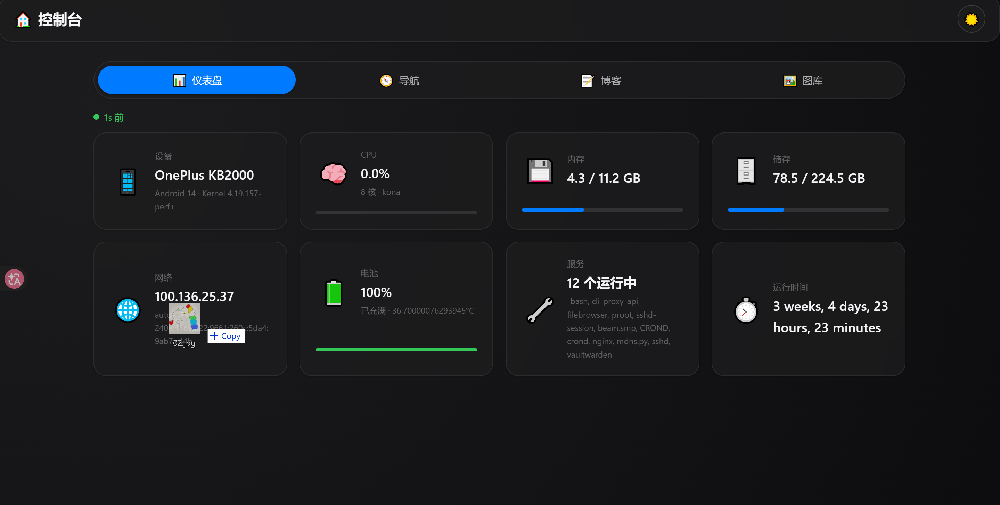
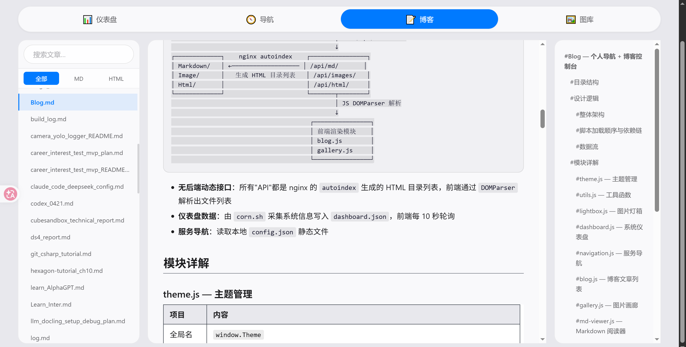
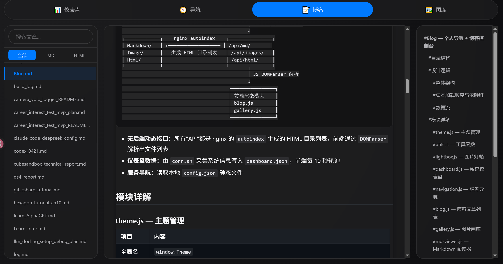

# Blog-termux — 个人控制台 + 博客系统

[简体中文](README_ZH.md) | [English](README.md)

> 纯静态单页面应用，Nginx 驱动，**零后端运行时**（无 PHP/Node.js/Python）。
> 集成仪表盘、服务导航、Markdown 博客、图片画廊四大模块，自适应 PC/平板/手机。





---

## ✨ 特性一览

| 特性 | 说明 |
|------|------|
| 🔋 **零后端** | 纯静态文件，仅依赖 Nginx 的 autoindex 模块 |
| 📊 **系统仪表盘** | CPU/内存/存储/网络/电池/服务/运行时间，30 秒轮询 |
| 🧭 **服务导航** | 可配置的分组服务卡片，一键跳转 |
| 📝 **Markdown 博客** | 三栏 Hugo Book 风格阅读器，内联渲染 + ToC + KaTeX 数学公式 + TikZ 图表 + Mermaid 图表 |
| 🖼️ **图片画廊** | 网格展示 + 搜索 + 灯箱 |
| 🌙 **深色模式** | 一键切换，自动保存偏好 |
| 📡 **离线可用** | Service Worker 缓存策略，文章/图片离线可读 |
| 🛡️ **安全** | 五层 HTML 白名单、URL 安全验证、用户内容转义 |
| 🔧 **零 root** | 所有系统指标采集无需 root 权限 |
| 🧹 **代码质量** | ES Modules + JSDoc + ESLint + Prettier + Stylelint + CI 门禁 |

> 项目最初 fork 自 [bastienwirtz/homer](https://github.com/bastienwirtz/homer)，经长期使用持续改造，最终演变为独立形态。
> 附：[Termux 使用总结](Markdown/termux使用总结.md)

---

## 🚀 快速开始

```bash
# 1. 克隆
git clone https://github.com/lost-clouds/Blog-termux.git ~/Blog-termux

# 2. 下载前端依赖（一次性，后续完全离线）
cd ~/Blog-termux/lib
curl -sSLO https://cdn.jsdelivr.net/npm/marked/marked.min.js
curl -sSLO https://cdn.jsdelivr.net/npm/katex/dist/katex.min.js
curl -sSLO https://cdn.jsdelivr.net/npm/katex/dist/katex.min.css
curl -sSLO https://cdn.jsdelivr.net/npm/katex/dist/contrib/auto-render.min.js
curl -sSLO https://cdn.jsdelivr.net/npm/github-markdown-css/github-markdown.min.css

# 3. 配置 Nginx
cp example/Blog.conf $PREFIX/etc/nginx/conf.d/Blog.conf
# 编辑：将所有 /path/to/Blog-termux 替换为实际路径

# 4. 配置仪表盘定时采集（每 30 秒）
# crontab 添加：
#   * * * * * bash ~/Blog-termux/cron.sh ~/Blog-termux/dashboard.json
#   * * * * * sleep 30; bash ~/Blog-termux/cron.sh ~/Blog-termux/dashboard.json

# 5. （可选）生成静态索引，加速加载
bash ~/Blog-termux/gen_index.sh ~/Blog-termux
# 可加入 cron：*/5 * * * * bash ~/Blog-termux/gen_index.sh ~/Blog-termux

# 6. 重载 Nginx 并访问
nginx -s reload
# 浏览器打开 http://127.0.0.1:7443
```

---

## 🏗️ 架构设计

### 整体布局

```
index.html (SPA 唯一入口)
  │
  ├─ header ─── 品牌标题 + 主题切换按钮
  │
  ├─ tab-bar ── [仪表盘] [导航] [博客] [图库]
  │             PC/平板顶部 | 手机底部固定
  │
  ├─ 内容区 (4 个 section，同时显示 1 个)
  │   ├── #sec-dashboard    8 张卡片：设备 / CPU / 内存 / 储存 / 网络 / 电池 / 服务 / 运行时间
  │   ├── #sec-nav          服务分组卡片 + 搜索过滤
  │   ├── #sec-blog         三栏：文章目录 | 内联渲染 | ToC，HTML 文章新标签页打开
  │   └── #sec-gallery      图片网格 + 搜索 + 灯箱
  │
  └─ lightbox ─── Markdown 图片 + 画廊共享
```

### 脚本加载链

```
main.js  →  app.js  →  theme.js, utils.js, lightbox.js
                    →  dashboard.js   (constants.js)
                    →  navigation.js  (utils.js, constants.js)
                    →  blog.js        (utils.js, md-viewer.js, constants.js)
                    →  gallery.js     (utils.js, lightbox.js, constants.js)
                    →  md-viewer.js   (utils.js, sanitizer.js, footnotes.js, lightbox.js, constants.js)
                    →  mermaid-renderer.js (constants.js)
                    →  tikz-renderer.js   (转发到 tikz/* — 无外部依赖)
```

所有业务 JS 使用 **ES Modules**（`import`/`export` 显式声明依赖）。`main.js` 仅一行 `import './app.js'`。唯一保留的常规 `<script>` 是 `lib/marked.min.js`。

### 数据流

```
                    gen_index.sh (可选定时)
                    ──────────────────────→  Markdown/index.json
                                              Html/index.json
                    cron.sh (cron 每30s)       Image/index.json
                    ──────────────────────→  dashboard.json
                                               │
                                               │ 优先: fetch index.json
                                               │ 降级: DOMParser 解析 nginx autoindex HTML
                                               ↓
Markdown/Html/Image/ ── nginx autoindex ──→  /api/md/ | /api/html/ | /api/images/
                                               │
GET /api/dashboard ───────────────────────────┘
                                               ↓
dashboard.js (30s 轮询)         blog.js / gallery.js
→ 更新 8 张仪表盘卡片             → 渲染文章列表 / 图片网格
```

**核心设计**：`index.json` 优先 → nginx autoindex 降级。前端先 fetch 结构化 JSON（快速可靠），若索引未生成（404）则降级为 `DOMParser` 解析 autoindex HTML，实现零后端的文件发现。

---

## 📁 目录结构

```
Blog-termux/
├── index.html                  # 唯一入口 — 标签页 SPA
├── config.json                 # 服务导航配置
├── cron.sh                     # 系统指标采集脚本（零 root）
├── gen_index.sh                # 静态索引生成器
├── sw.js                       # Service Worker（离线缓存）
├── styleguide.md               # 代码规范（命名/注释/模块边界/工具链）
│
├── css/
│   ├── style.css               # 构建产物（由 build.sh 合并生成，禁止手改）
│   ├── build.sh                # 合并脚本
│   └── src/                    # 唯一可编辑的 CSS 源
│       ├── variables.css       #   CSS 自定义属性
│       ├── base.css            #   重置 + 排版
│       ├── layout.css          #   页面布局
│       ├── responsive.css      #   响应式断点
│       ├── components/         #   10 个组件样式
│       └── themes/dark.css     #   深色模式覆盖
│
├── js/                         # ES Modules（入口 + 业务 + tikz/ 子模块）
│   ├── main.js                 #   入口（import './app.js'）
│   ├── app.js                  #   主控制器（引导、路由、协调）
│   ├── theme.js                #   主题管理
│   ├── utils.js                #   工具函数 + URL 安全验证
│   ├── constants.js            #   路径常量
│   ├── sanitizer.js            #   HTML 白名单清理器
│   ├── footnotes.js            #   脚注预处理器
│   ├── lightbox.js             #   图片灯箱
│   ├── dashboard.js            #   系统仪表盘
│   ├── navigation.js           #   服务导航
│   ├── blog.js                 #   文章列表 + 内联渲染
│   ├── gallery.js              #   图片画廊
│   ├── mermaid-renderer.js      #   Mermaid 图表渲染
│   ├── md-viewer.js            #   Markdown 渲染引擎
│   ├── tikz-renderer.js         #   TikZ → SVG 入口（转发到 js/tikz/*）
│   └── tikz/                   #   TikZ → SVG 引擎（由单文件拆分为 14 个模块）
│       ├── render.js           #    编排入口：prepareTikzBlocks / renderTikz
│       ├── script.js           #    预处理、语句切分、foreach/宏展开
│       ├── context.js          #    命名坐标、节点盒、循环变量、包围盒
│       ├── expr.js             #    数学表达式求值与坐标解析（含锚点/坐标运算）
│       ├── options.js          #    选项解析 → 描边/虚线/字号/缩放/相对定位
│       ├── styles.js           #    样式定义解析（X/.style 与 node distance）
│       ├── units.js            #    长度单位换算（cm/mm/pt/px → TikZ 单位）
│       ├── node.js             #    \node 渲染（形状 + 文本/数学 + 相对定位）
│       ├── path.js             #    \draw / \fill 路径 token 化
│       ├── shapes.js           #    圆/矩形/网格/plot/箭头
│       ├── text.js             #    有效显示长度估算、转义、数学切分
│       ├── math.js             #    KaTeX 懒加载 + <foreignObject> 数学填充
│       ├── color.js            #    命名/hex/TikZ 颜色混合（red!40!blue）
│       └── constants.js        #    单位、调色板、正则、忽略命令
│
├── Html/                       # HTML 页面（由 gen_index.sh 索引）
├── Image/                      # 图片资源（posts / gallery / thumbnails）
├── Markdown/                   # .md 文章
│
├── lib/                        # 第三方库（本地化，零 CDN 运行时依赖）
│   ├── marked.min.js
│   ├── katex.min.js + .css
│   ├── auto-render.min.js
│   └── github-markdown.min.css
│
├── example/
│   ├── Blog.conf               # Nginx 配置模板
│   └── example*.png            # 界面截图
│
├── resume/                     # 独立简历子站点（自含入口）
│   ├── index.html
│   ├── config.json
│   ├── css/resume.css
│   └── js/resume.js
│
└── .github/workflows/
    ├── lint.yml                # PR 门禁：JS/CSS/Shell 检查
    └── release.yml             # tag 发布：构建 + 打包 + Release
```

---

## 📦 模块详解

### 总览

| 模块 | 职责 | 依赖 | 关键实现 |
|------|------|------|----------|
| `app.js` | 启动、标签路由、键盘导航、SW 注册 | 全部模块 | 有序初始化，首次访问懒加载博客/画廊 |
| `theme.js` | 浅色/深色切换 | — | `localStorage` 持久化，`prefers-color-scheme` 回退 |
| `utils.js` | 共享工具 | — | `escapeHtml`、`getSafeUrl`（白名单）、`fetchIndexOrAutoindex`（双源加载） |
| `constants.js` | 路径注册 | — | 所有 API 路由 + 库路径集中管理 |
| `sanitizer.js` | HTML 清理 | — | 五层白名单：标签、属性、URL、class、style |
| `footnotes.js` | 脚注预处理 | — | `[^id]` 定义 → 编号脚注 + 返回链接 |
| `lightbox.js` | 图片灯箱 | — | 点击/ESC/背景关闭，焦点恢复 |
| `dashboard.js` | 系统仪表盘 | `constants.js` | 8 卡片，30s 轮询 + 8s 超时，页面可见性暂停，渐进错误降级 |
| `navigation.js` | 服务导航 | `utils.js`, `constants.js` | `config.json` 分组渲染，250ms 防抖搜索 |
| `blog.js` | 博客阅读器 | `utils.js`, `md-viewer.js`, `constants.js` | 三栏布局，`Promise.allSettled` 双目录，请求 ID 竞态防护 |
| `gallery.js` | 图片画廊 | `utils.js`, `lightbox.js`, `constants.js` | 缩略图网格，懒加载，250ms 防抖搜索 |
| `md-viewer.js` | Markdown 渲染引擎 | `utils.js`, `sanitizer.js`, `footnotes.js`, `lightbox.js`, `constants.js` | 完整管道：脚注 → 数学 → marked → 清理 → 图片路径 → 锚点 → Mermaid → TikZ → KaTeX |
| `mermaid-renderer.js` | Mermaid 图表渲染 | `constants.js` | 懒加载 Mermaid → SVG，语法错误优雅降级 |
| `tikz-renderer.js` | 基础 TikZ → SVG 渲染（入口） | `tikz/*`（14 个模块） | 零依赖客户端 TikZ 解析，支持节点、带箭头连线、圆、矩形、网格（对角端点、`step=N`、`\fill … grid`）、贝塞尔曲线、圆弧、函数曲线、`\foreach` 循环（含 `{a,b,...,z}` 中置省略号步长、遍历 `\coordinate` 名称的字符串循环变量）、`\pgfmathsetmacro`、颜色混合（`red!40!blue`）、KaTeX 数学节点、路径行内 `node[...]` 标签（`node[midway]` / `node[above right]` / `at (x,y)`）、**相对定位**（`below=of X` / `right=2.5cm of X` / `xshift` / `yshift`）、**样式定义**（`X/.style={…}`）、**节点锚点引用**（`at (X.south west)`）与 `$...$ 坐标运算`、最小尺寸（`minimum width/height`）。固定缩放：1 TikZ 单位 = 32px。逻辑已拆分到 `js/tikz/`，便于维护 |
| `sw.js` | Service Worker | — | Cache-first（静态）、SWR（文章/图片）、Network-first（入口）、Network-only（实时） |

### 核心模块详解

#### dashboard.js — 系统仪表盘

每 **30 秒** 轮询 `GET /api/dashboard`，带 **8 秒 AbortController 超时**。离开标签页或页面不可见时暂停轮询。错误降级：1 次失败 → 提示，2–5 次 → 过期指示，5 次以上 → 全部重置。

**8 张卡片：**

| 卡片 | 内容 | 进度条 |
|------|------|:---:|
| 📱 设备 | 品牌型号 · Android 版本 · 内核版本 | — |
| 🧠 CPU | 使用率% · 核心数 · 型号 · 集群负载 | 蓝色 |
| 💾 内存 | used / total + SWAP（SWAP=0 时隐藏） | 蓝色 |
| 🗄️ 储存 | used / total | 蓝色 |
| 🌐 网络 | 局域网 IP · 接口 · IPv6 | — |
| 🔋 电池 | 电量% · 充电状态 · 温度 | 绿色 |
| ⚙️ 服务 | N 个运行中 · 进程名列表 | — |
| ⏱️ 运行时间 | 如 "3d 12h 30m" | — |

`dashboard.json` 由 `cron.sh` 生成，格式示例：

```json
{
  "timestamp": "2026-06-12T14:30:00+08:00",
  "device": {"model": "OnePlus KB2000", "android": "14", "kernel": "4.19"},
  "cpu": {
    "usage": 46.6, "cores": 8, "model": "kona",
    "clusters": {
      "Cortex-A73": {"cores": 4, "usage": 95.5, "freq_max": 2400, "freq_min": 300},
      "Cortex-A53": {"cores": 4, "usage": 0.0,  "freq_max": 1901, "freq_min": 300}
    }
  },
  "memory": {"used": 4.3, "total": 11.2, "unit": "GB", "swap_used": 2.0, "swap_total": 8.0},
  "disk": {"used": 64.8, "total": 224.5, "unit": "GB"},
  "network": {"ip": "192.168.1.5", "ipv6": "240e:...", "iface": "wlan0"},
  "battery": {"level": 85, "status": "FULL", "temp": 40.0},
  "services": {"running": ["nginx", "crond", "sshd", "vaultwarden"], "count": 4},
  "uptime": "2 weeks, 1 day, 4h"
}
```

> `cpu.clusters` 为可选字段（无 cpufreq/lscpu 时不出现）。集群名优先从 `lscpu` Model name 获取，其次 `/proc/cpuinfo` CPU part → ARM Cortex/X 映射。

#### blog.js — 博客阅读器

Hugo Book 风格三栏布局。`Promise.allSettled` 同时获取 Markdown + HTML 双目录（一个失败不影响另一个）。`AbortController` + 请求 ID 计数器双重竞态防护。

| 特性 | 说明 |
|------|------|
| 数据源 | `index.json` 优先 → nginx autoindex 降级（Markdown + HTML 双目录） |
| 过滤 | 全部 / Markdown / HTML 类型切换 |
| 搜索 | 250ms 防抖，匹配文件名 |
| Markdown | 内联渲染 + 自动生成 ToC |
| HTML | 新标签页打开 |

#### md-viewer.js — Markdown 渲染引擎

纯渲染模块，不管理 DOM 生命周期。完整 10 步管道：

| 步骤 | 实现 |
|------|------|
| 1. 脚注 | 预处理 `[^id]` 定义 → 编号脚注 + 返回链接（跳过围栏/行内代码） |
| 2. 数学提取 | 三阶段：`$$` → `\[` → `\(`，split→aligned 标准化（跳过围栏/行内代码） |
| 3. Markdown 解析 | `marked.parse()` + 数学占位符 |
| 4. XSS 清理 | 五层白名单（标签、属性、URL、class、style） |
| 5. 块转换 | `<pre><code>` → Mermaid/TikZ `<div>`（sanitize 后、DOM 操作前） |
| 6. 图片路径 | 相对路径重写为 `/api/images/` |
| 7. 标题锚点 | 自动注入 `#` 链接，支持中文 slug |
| 8. 图片绑定 | 委托点击 → 共享 `Lightbox` |
| 9. 数学恢复 | 恢复占位符 + KaTeX 懒加载（检测到块级或行内 `$...$` 才加载） |
| 10. 图表渲染 | 先 Mermaid 懒渲染，后 TikZ → SVG（零依赖客户端，支持节点、带箭头连线、圆、矩形、网格、贝塞尔、圆弧、函数曲线、`\foreach` 循环（含 `{a,b,...,z}` 步长与命名坐标字符串变量）、`\pgfmathsetmacro`、行内 `node[...]` 标签、数学节点、**相对定位 `below=of X` / `right of X` / `xshift` / `yshift`**、**样式 `X/.style`**、**锚点引用与 `$...$` 坐标运算**）；整图 `[scale=]` 与 `node distance=` 生效，固定缩放 1 单位 = 32px |

#### navigation.js — 服务导航

读取 `config.json`，按分组渲染服务卡片。搜索匹配 `name`、`subtitle`、`tag`，250ms 防抖。URL 经 `Utils.getSafeUrl()` 安全验证 — 不安全 URL 渲染为不可点击的 `<div>`。外部链接使用 `target="_blank" rel="noopener"`。

---

## 📋 部署教程

### 环境要求

| 组件 | 用途 | 安装 |
|------|------|------|
| Nginx | Web 服务器 | `pkg install nginx` |
| cron / crond | 定时执行 cron.sh | `pkg install cronie termux-services` |
| curl | 下载依赖库（一次性） | 已有 |
| Node.js + npm | 代码检查（可选） | `pkg install nodejs-lts` |
| termux-api | 电池信息（可选） | `pkg install termux-api` |

> **无需**：PHP、Node.js、Python、MySQL、Docker。

### 2. 下载依赖库

以下 5 个文件放入 `lib/`。**下载一次，后续完全离线。**

```bash
mkdir -p ~/Blog-termux/lib && cd ~/Blog-termux/lib

curl -sSLO https://cdn.jsdelivr.net/npm/marked/marked.min.js
curl -sSLO https://cdn.jsdelivr.net/npm/katex/dist/katex.min.js
curl -sSLO https://cdn.jsdelivr.net/npm/katex/dist/katex.min.css
curl -sSLO https://cdn.jsdelivr.net/npm/katex/dist/contrib/auto-render.min.js
curl -sSLO https://cdn.jsdelivr.net/npm/github-markdown-css/github-markdown.min.css
curl -sSLO https://cdn.jsdelivr.net/npm/mermaid@11/dist/mermaid.min.js

ls -lh lib/   # 应显示 6 个文件，约 2.3MB
```

### 3. 配置 Nginx

```bash
cp ~/Blog-termux/example/Blog.conf $PREFIX/etc/nginx/conf.d/Blog.conf
sed -i 's|/path/to/Blog-termux|/实际/路径|g' $PREFIX/etc/nginx/conf.d/Blog.conf

# 确保 nginx.conf 引入站点配置：
#   http { include conf.d/*.conf; }

nginx -t && nginx -s reload
```

### 4. 配置服务导航

编辑 `config.json`：

```json
{
  "services": [
    {
      "name": "Server",
      "icon": "🖥️",
      "items": [
        {
          "name": "示例服务",
          "icon": "🤖",
          "subtitle": "简短描述",
          "tag": "AI",
          "url": "https://your-server.local:8443/"
        }
      ]
    }
  ]
}
```

| 字段 | 说明 |
|------|------|
| `name` | 显示名称 |
| `icon` | emoji 图标（无需图标字体） |
| `subtitle` | 卡片描述 |
| `tag` | 右上角标签 |
| `url` | 跳转地址 |

修改后刷新页面即可生效。

### 添加内容

| 内容类型 | 放入目录 | 发现方式 |
|----------|----------|----------|
| Markdown | `Markdown/` | `index.json` → autoindex 降级 |
| HTML | `Html/` | `index.json` → autoindex 降级，新标签页打开 |
| 图片 | `Image/` | `index.json` → autoindex 降级 |

> `gen_index.sh` 自动跳过 `thumbnails/` 和 `archive/` 目录。运行 `bash gen_index.sh ~/Blog-termux` 生成静态索引，可选加入 cron：`*/5 * * * * bash ~/Blog-termux/gen_index.sh ~/Blog-termux`

---

## 🎮 使用指南

| 操作 | 方式 |
|------|------|
| 切换标签 | PC/平板：点击顶部标签栏。手机：点击底部导航栏 |
| 深色模式 | 点击右上角 ☀/☾ 按钮，偏好自动保存 |
| 搜索服务 | 「导航」标签 → 搜索框输入（匹配名称/描述/标签） |
| 搜索文章 | 「博客」标签 → 搜索框输入 → 类型过滤 |
| 阅读文章 | 点击文章 → 正文内联渲染 + 自动生成目录 |
| 浏览图片 | 「图库」标签 → 搜索或滚动 → 点击灯箱放大 |
| 快捷键 | `←` `→` 切换标签，`Home` `End` 跳转首/末，`ESC` 关闭灯箱 |

---

## ❓ 常见问题

### 博客/图库/导航显示"加载中"？

```bash
curl http://127.0.0.1:7443/api/md/     # autoindex 是否正常？
ls ~/Blog-termux/Markdown/              # 目录是否为空？
# 检查浏览器控制台 (F12) — 通常是 nginx 路径配置问题
```

### 仪表盘卡片显示 "--"？

```bash
cat ~/Blog-termux/dashboard.json        # 文件存在且为有效 JSON？
bash ~/Blog-termux/cron.sh              # 手动执行一次
ps aux | grep crond                     # cron 是否运行？
```

### 电池卡片显示 "--"？

安装 `termux-api`（Android 还需安装 Termux:API 应用并授权），未安装时不影响其他功能。

### Markdown 图片不显示？

将图片放入 `Image/` 目录，文章中引用文件名即可（阅读器自动重写路径为 `/api/images/<文件名>`）。

### 数学公式显示为原始文本？

确认 `lib/` 中存在 `katex.min.js` 和 `auto-render.min.js`。KaTeX 按需加载，检查浏览器控制台有无 404。

---

## 🔧 开发

### 代码规范

项目提供 [`styleguide.md`](styleguide.md) 定义完整的代码规范，包括：

- **模块边界** — 各目录读写规则（`lib/` 只读、`css/style.css` 构建产物等）
- **JavaScript 规范** — ES Modules、命名约定、JSDoc 注释模板
- **CSS 规范** — 变量命名、组件分区、BEM 命名
- **Shell 脚本规范** — 头部格式、fallback 链注释
- **HTML 规范** — 区块注释格式
- **工具链** — ESLint + Prettier + Stylelint + ShellCheck
- **模块清单** — 所有模块的暴露方式、依赖、职责

```bash
npm install     # 安装开发依赖
npm run lint    # JS/CSS/Shell 代码检查
npm run format  # 自动格式化
```

### CI 工作流

| Workflow | 触发条件 | 检查内容 |
|----------|----------|----------|
| `lint.yml` | PR 推送（仅 JS/CSS/Shell 变更时） | ESLint + Stylelint + ShellCheck |
| `release.yml` | tag 推送 | lint 检查通过后构建打包发布 |

---

## 📄 技术要点

| 特性 | 实现方式 |
|------|----------|
| 🔌 零后端 | nginx autoindex + `DOMParser` 降级解析 |
| 📦 零外部依赖 | 所有库本地化在 `lib/`，一次下载完全离线 |
| 🔒 无 root | `cron.sh` 使用 `/proc/stat` / `free` / `df` / `ps` / `getprop` |
| 🛡️ 安全 | 五层 HTML 白名单 + URL 白名单 + `escapeHtml` 转义 |
| 📡 离线 | Service Worker 四策略：cache-first、SWR、network-first、network-only |
| 🌙 主题 | CSS 自定义属性 + `body.dark` 切换，系统偏好自动检测 |
| 📱 响应式 | 3 断点（1024px / 639px / 400px），顶部标签 → 底部导航 |
| ⚡ 性能 | 非活跃标签不请求，KaTeX 按需加载，dashboard 可见性暂停 |
| 🛡️ 竞态防护 | `AbortController` + 请求 ID 计数器，`Promise.allSettled` 多源容错 |
| 🧹 代码质量 | JSDoc 全覆盖、ES Modules、ESLint + Prettier + Stylelint + CI 门禁 |

---

## 🔗 友链

[linux.do](https://linux.do)
